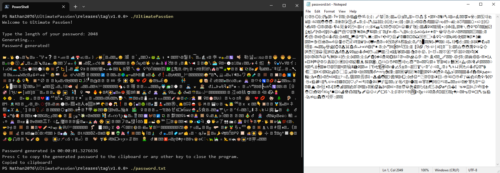
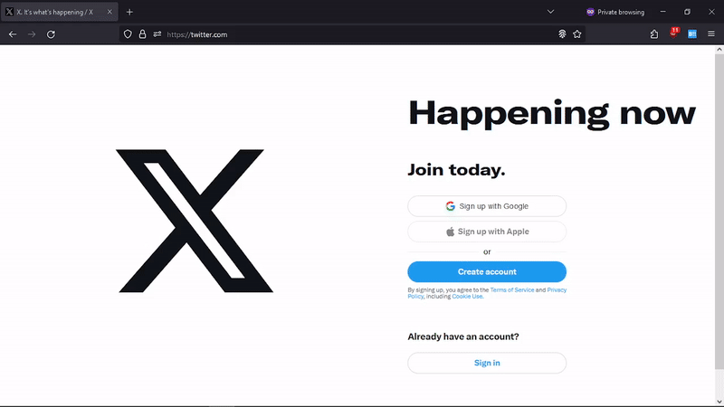
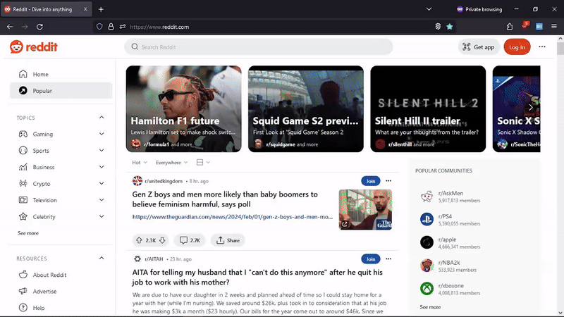

<h1 align="center">Ultimate PassGen</h1>
<p align="center">A simple but above-the-average password generator written in C#</p>
<p align="center">
  <a href="https://github.com/Nathan2076/PasswordGenerator/actions/workflows/dotnet.yml">
    </a>
</p>
<br />

## Overview

This is a simple password generation program written in C#. It features all [Unicode characters](https://www.unicode.org/charts/) and [emoji](https://www.unicode.org/emoji/charts/), with more than 153,000 characters available for your passwords.


## Usage

Download your desired version in the Releases tab on the right, and, with [Windows Terminal](https://github.com/microsoft/terminal) (recommended), PowerShell, or Command Prompt, in the folder you downloaded the program, type `./UltimatePassGen`.

From here, everything is pretty self-explanatory. Type the password length on the first input, hit `Enter`, and it will generate a password for you. To copy it to the clipboard, press C. Alternatively, a file named `password.txt` will be created with the generated password in it, so you can open and copy it with `Ctrl + A` and `Ctrl + C`.


## Examples








## What's to Come

Future plans!

Planned for v1.1.0:
- Uppercase/lowercase letters, numbers, symbols, emoji & Unicode selectors;
- Implementation in C++ for performance & JavaScript for online usage;
- Translation for Portuguese.

Planned for v1.2.0:
- Individual character selector;
- Built-in entropy calculator;


## Building it Yourself

- Download and install the [.NET 8.0 SDK](https://dotnet.microsoft.com/en-us/download/dotnet/8.0);
- Run the following commands inside a folder of your choice:
```
$ git clone https://github.com/Nathan2076/UltimatePassGen.git
$ cd ./UltimatePassGen/src
$ dotnet build
$ ./bin/Debug/net8.0/UltimatePassGen
```


## License

Ultimate PassGen is licensed under the [GNU Affero General Public License v3.0](https://www.gnu.org/licenses/agpl-3.0.en.html), check [its terms](./LICENSE) before using, distributing, or modifying any parts of this project.


## Credits

This project got some inspirations from [MakeMeAPassword](https://makemeapassword.ligos.net/), by [ligos](https://github.com/ligos). I highly recommend it!
